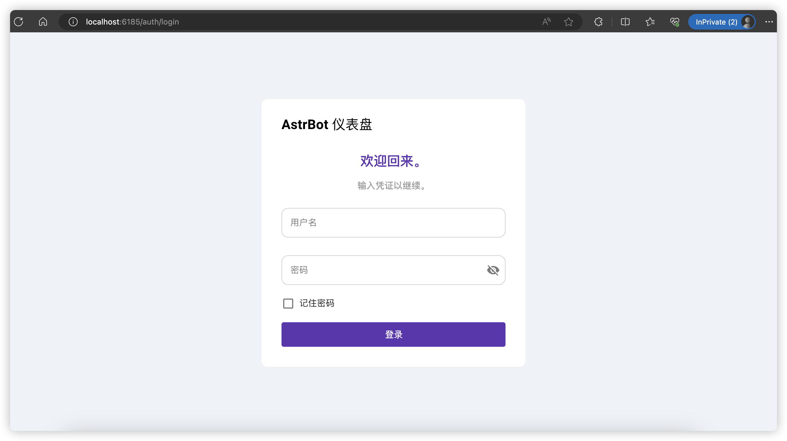

:::caution

此项目需要 Python 版本 >= 3.9。如果你的 Linux/Mac/Windows 的 Python 版本小于这个版本的话，需要重新安装。或者，更简单的方式，你可以使用 Docker 容器来一键安装。 详见：[通过 Docker 部署](通过Docker部署)

:::


## 下载项目
```bash
git clone https://github.com/Soulter/AstrBot.git
cd AstrBot
```

## 运行项目

```bash
python3 main.py
```

成功运行之后，你会在控制台发现：

```log
[12-25 12:10:39] [INFO] [可视化面板]: 
[12-25 12:10:39] [INFO] [可视化面板]: ==================
[12-25 12:10:39] [INFO] [可视化面板]: 您可以访问:
[12-25 12:10:39] [INFO] [可视化面板]: 
[12-25 12:10:39] [INFO] [可视化面板]:   http://198.18.0.1:6185
[12-25 12:10:39] [INFO] [可视化面板]:   http://localhost:6185
[12-25 12:10:39] [INFO] [可视化面板]: 
[12-25 12:10:39] [INFO] [可视化面板]: 来登录可视化面板。
[12-25 12:10:39] [INFO] [可视化面板]: 注意: 所有配置项现已全量迁移至 cmd_config.json 文件下。您可以登录可视化面板在线修改配置。
[12-25 12:10:39] [INFO] [可视化面板]: ==================
```

这时，你可以任意打开一个链接，即可看到本项目的可视化面板。如果提示需要登录，请直接点击登录按钮。密码和用户名可在之后修改。密码使用 MD5 加密，并且只存于本地。

对于这个面板的使用，详见：[可视化面板的使用](/使用/可视化面板)



:::caution

**告知老用户**：这是最近新加入的功能，在以后的版本中，AstrBot 将弃用 `configs/config.yaml` 配置文件，会将其中的内容全部转移至 `cmd_config.json` 下，以避免 Git 冲突的发生。

:::

至此，部署完毕。

## 如何放到后台运行？

可以使用 `nohup` 指令。

推荐使用 `tmux` 工具。[Linux tmux 終端機管理工具使用教學](https://blog.gtwang.org/linux/linux-tmux-terminal-multiplexer-tutorial/)